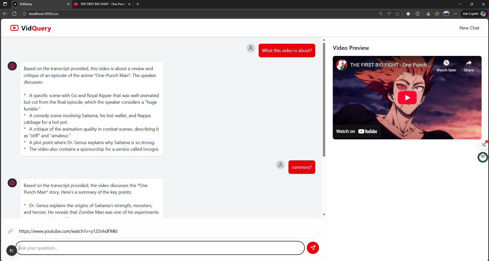

# VidQuery: YouTube Video Chatbot

An AI-powered application allowing users to interactively chat with YouTube videos, getting summaries and answers based directly on the video's transcript content using Retrieval-Augmented Generation (RAG).


---

## 📖 About The Project

VidQuery bridges the gap between passive video consumption and active information retrieval. Instead of manually scrubbing through long videos, users can simply paste a YouTube link and ask questions directly. The application fetches the video's transcript, processes it using advanced AI models (Google Gemini via LangChain), and provides concise, contextually relevant answers based solely on the spoken content.

It utilizes a Retrieval-Augmented Generation (RAG) pipeline: fetching the transcript, splitting it into searchable chunks, embedding these chunks into a vector store (FAISS), retrieving the most relevant chunks based on the user's query, and finally, generating a factual answer using a powerful language model guided by the retrieved context.




---

## 🌟 Key Features

-   **Instant Transcript Fetching**: Automatically retrieves available English transcripts using `youtube-transcript-api`.
-   **Intelligent Translation Fallback**: If no English transcript exists, it attempts to translate an available transcript into English.
-   **AI-Powered Q&A**: Leverages Google Gemini models via LangChain to understand questions and generate answers based on transcript content.
-   **Retrieval-Augmented Generation (RAG)**: Ensures answers are grounded in the video's actual content by retrieving relevant text chunks before generation.
-   **Interactive Chat Interface**: A user-friendly, real-time chat UI built with Next.js and Tailwind CSS.
-   **Video Preview**: Displays the YouTube video alongside the chat for easy reference.
-   **Efficient Backend**: Uses FastAPI for a high-performance Python backend to handle transcript processing and AI interactions.
-   **Optimized Performance**: Includes backend caching to avoid reprocessing the same video transcript repeatedly for subsequent questions.

---

## 🔧 Tech Stack

This project utilizes a modern full-stack approach, separating the frontend presentation from the backend AI processing logic.

| Technology             | Role & Justification                                                                                                                               |
| :--------------------- | :------------------------------------------------------------------------------------------------------------------------------------------------- |
| **Next.js (TS)** | **Frontend Framework**: Provides a fast, interactive user experience with server components and easy routing for the chat interface.                 |
| **Python** | **Backend Language**: The standard for AI/ML tasks, necessary for integrating LangChain and related libraries.                                       |
| **FastAPI** | **Backend Framework**: High-performance Python framework chosen for its speed, async capabilities, and automatic API documentation, ideal for the AI backend. |
| **LangChain** | **AI Orchestration**: The core framework used to build the RAG pipeline, connecting transcript splitting, embeddings, vector store, and the LLM. |
| **Google Gemini API** | **AI Models**: Provides state-of-the-art embedding (`gemini-embedding-001`) and generative (`gemini-pro`/`gemini-1.5-pro`) models for the RAG process.        |
| **youtube-transcript-api** | **Transcript Retrieval**: A specialized Python library to efficiently fetch YouTube video transcripts, including translation capabilities.          |
| **FAISS** | **Vector Store**: Efficient library for similarity search, used to quickly find relevant transcript chunks based on the user's query embedding.      |
| **Tailwind CSS** | **CSS Framework**: Enables rapid development of the modern, responsive chat UI with utility-first classes.                                           |
| **python-dotenv** | **Environment Management**: Used in the backend to securely load API keys from a `.env` file.                                                        |
| **Uvicorn** | **ASGI Server**: Runs the FastAPI application.                                                                                                     |
| **Vercel** | **Frontend Hosting**: Platform optimized for Next.js, providing seamless deployment and scaling for the user interface.                              |
| **Render** | **Backend Hosting**: Platform suitable for deploying Python web services like the FastAPI backend, offering free tiers for small projects.           |

---

## 📦 Getting Started

To get a local copy up and running for development or testing, follow these steps.

### Prerequisites

-   **Node.js** (`v18` or higher recommended) & **npm**/**yarn**
-   **Python** (`v3.9` or higher recommended) & **pip**
-   A **Google AI API Key** (from [Google AI Studio](https://aistudio.google.com/app/apikey))

### Installation & Setup

1.  **Clone the repository:**
    ```bash
    git clone [[https://your-repo-link-here.git](https://your-repo-link-here.git)]
    cd [your-repo-name]
    ```
2.  **Setup the Python Backend (`backend/`):**
    ```bash
    cd backend
    python -m venv venv
    source venv/bin/activate  # On Windows: venv\Scripts\activate
    pip install -r requirements.txt
    ```
    Create a `.env` file in this `backend` directory and add your Google AI API key:
    ```env
    GEMINI_API_KEY="YOUR_GOOGLE_AI_API_KEY_HERE"
    ```
    *(Optional: If using Webshare for proxies, add `WEBSHARE_USERNAME` and `WEBSHARE_PASSWORD` here too)*

3.  **Setup the Next.js Frontend (`frontend/`):**
    ```bash
    cd ../frontend
    npm install
    # or yarn install
    ```
    *(No .env file needed for local frontend setup by default, as it connects to localhost:8000)*

### ▶️ Running the App

You need to run both the backend and frontend services concurrently in two separate terminal windows.

1.  **Start the FastAPI Backend:**
    ```bash
    # In backend/ (with venv activated)
    uvicorn main:app --reload --port 8000
    ```

2.  **Start the Next.js Frontend:**
    ```bash
    # In frontend/
    npm run dev
    # or yarn dev
    ```

The application should now be available at `http://localhost:3000`.

---

## 📁 Project Structure
